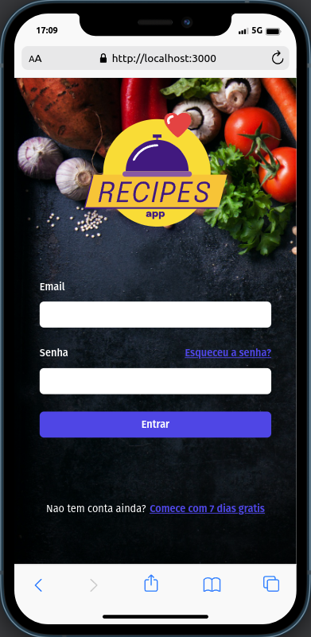
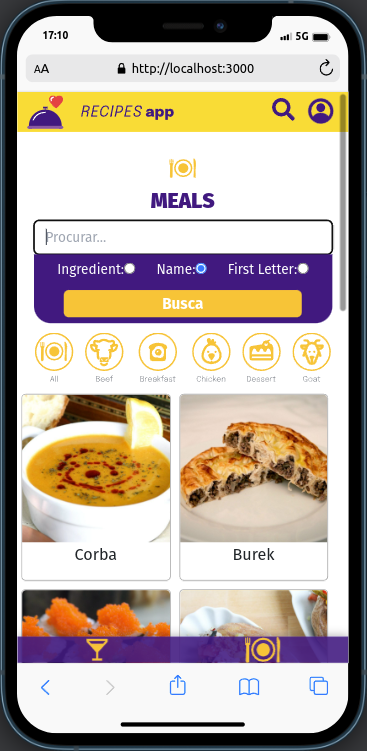

# :man_cook: Recipes App :plate_with_cutlery:

 
Utilize no Mobile, css ainda em construição para Desktop

# :camera_flash: Imagens do Projeto

  
<strong>Imagens</strong>
 
  
 
 

 

# :clipboard: About
Projeto Desenvolvido durante o curso da Trybe na formação do modulo de Front-End. Foi realizado em grupo, utilizando metodologias ageis, comunicação e outras soft skills.
 
O Aplicativo de Receita conta com diversas funcionalidades de uma aplicação real sendo dividido principalmente em drink e comidas, podendo realizar receitas, salva-las, ter seu proprio perfil, salvar receitas realizadas, etc.

 

# :hammer_and_wrench: Skills & Tools

- HTML5
- CSS3
- JavaScript ES6+
- React.js
- React Testing Library
- Jest
- Context API
- API
- Bootstrap
- Tailwind
- SweetAlert
- Mobile First

 

 
# :construction: To Implement :construction:

- CSS Responsivo
- Desktop CSS
